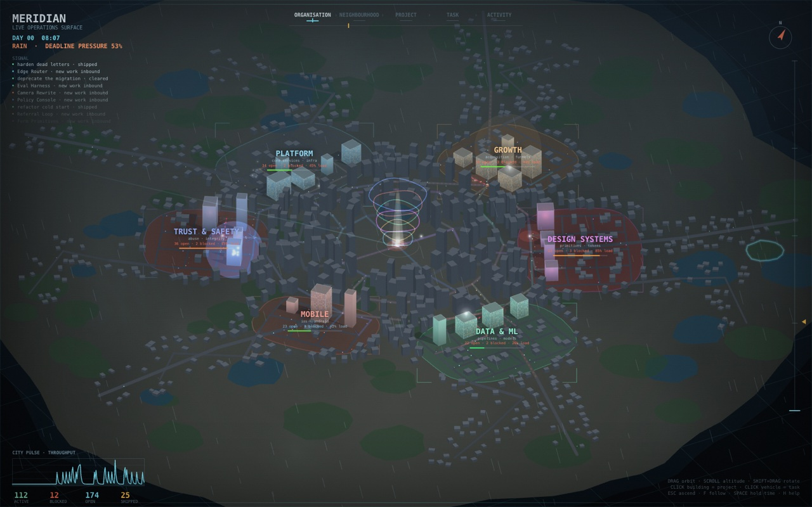
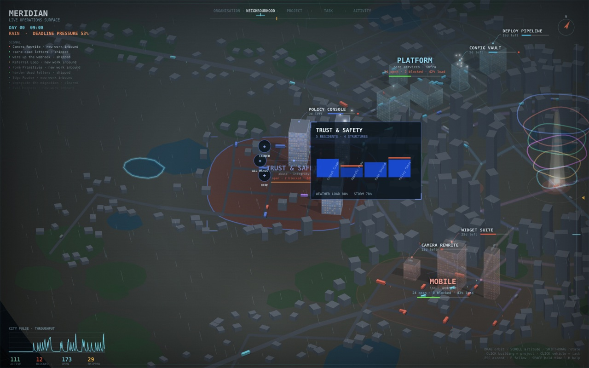
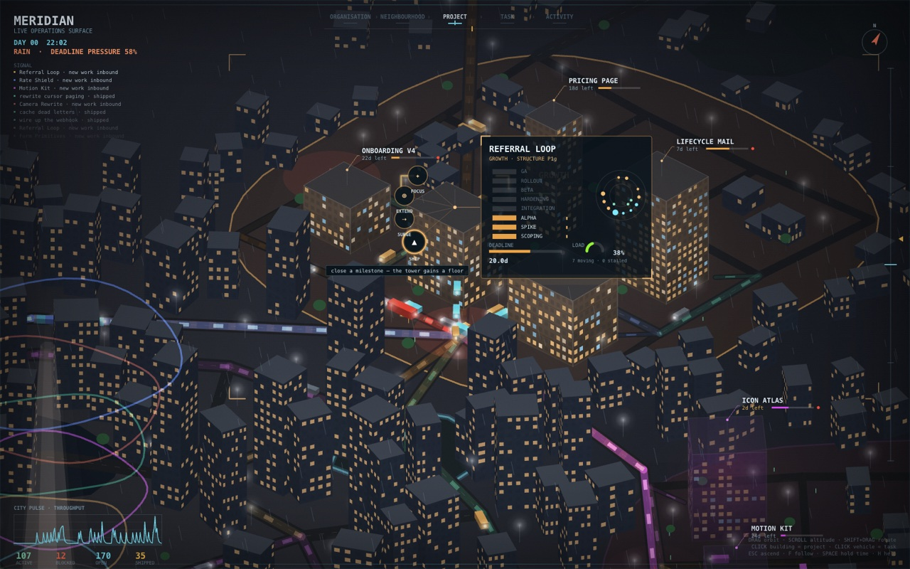
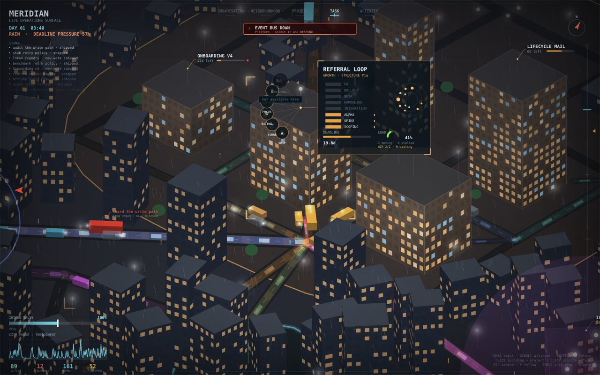
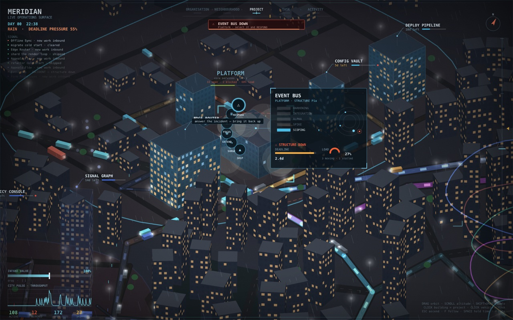
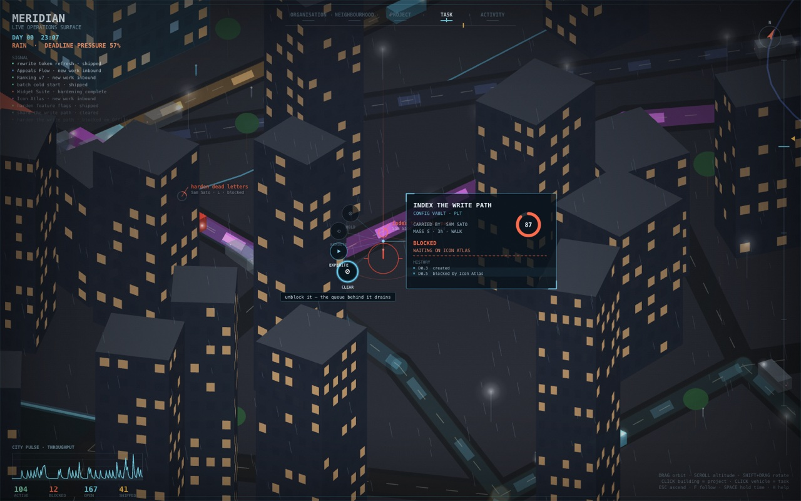
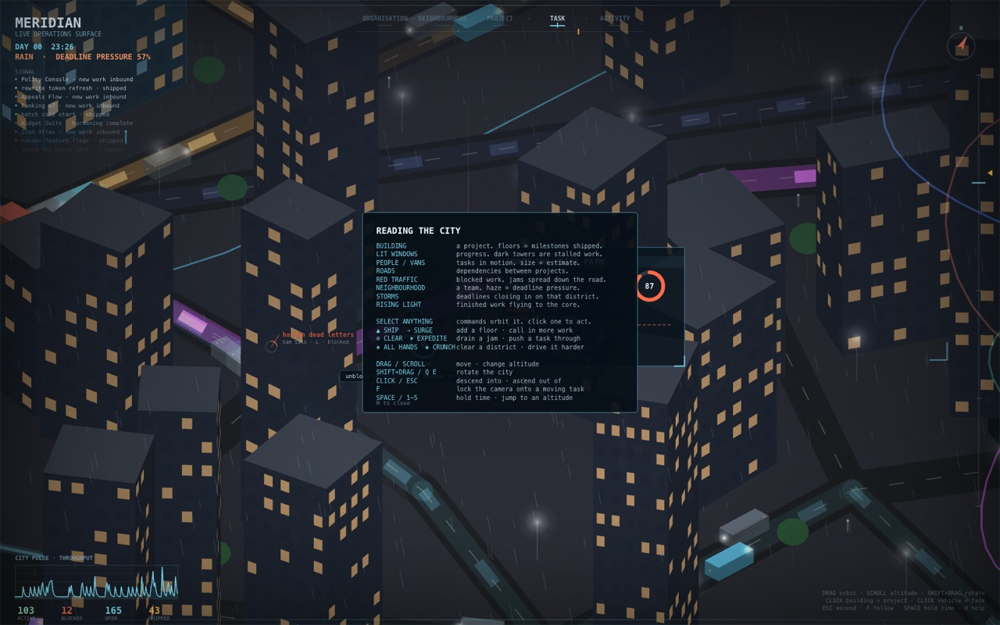

# MERIDIAN

**An organisation rendered as a living city.** No task table, no project card,
no list — the work *is* the city, and you navigate it by moving through space.

**→ [Open the city](https://jaiparmani.github.io/meridian-city/)**

No build, no server, no dependencies. Clone it and open `index.html`.



---

## What the city is

Every element on screen is a real property of the work. Nothing is decoration.

| In the city | In the work |
|---|---|
| **A structure** | a project. Floors are milestones shipped; lit windows are progress, filling from the ground up. |
| **A tower vs. a slab** | just architecture — but height tracks how much has actually landed. |
| **People and vehicles** | tasks in motion. A task's estimate is its **mass**: a 3-hour fix is a pedestrian, a 40-hour migration is a truck that accelerates slowly and takes an age to clear a junction. |
| **Roads** | dependencies, routed by shortest path through streets that actually exist. |
| **Neighbourhoods** | teams. The ground runs from the team's colour toward ember as their load rises. |
| **Weather** | deadlines. Pressure builds cloud, then rain, then storm cells that drift over the district causing them. Lightning rattles the camera. |
| **A traffic jam** | blocked work — and the jam is not a metaphor. See below. |
| **Rising motes of light** | finished work, falling toward downtown under gravity. |
| **The spire downtown** | the organisation itself. One ring per team; it brightens as work lands and shifts from cyan to ember as risk climbs. |
| **Grey blocks, parks, lamps** | civic fabric. They carry no data. They exist so the things that do have somewhere to stand. |

### The jam is the point

A blocked task does not turn red in a list. It **drives to the thing it is
waiting on and parks there.** Traffic behind it slows, queues, and backs up
through the junction. Congestion bleeds into every touching road at 46% per
hop, so one stalled dependency reddens a whole corridor — and when it clears,
the corridor drains from the outside in.

This is why the city can seize. It is also why clearing a blockage feels like
something.

## Five altitudes

`ORGANISATION → NEIGHBOURHOOD → PROJECT → TASK → ACTIVITY`

Zoom is continuous; the labels only name where you are. Detail is *earned* by
descending — from height a tower is just the light it emits; at street level it
has floor bands, windows, a crane, a beacon, and pedestrians.

Map symbols work in reverse. Dependency flow arrows are bright from above and
fade out as you reach the street, because down there the road itself is the
evidence.



## Commanding the city

Select anything and its commands **orbit it** — you reach for the city, not for
a toolbar. Every command has a physical consequence you can watch happen.



**On a structure**

| | |
|---|---|
| `▲ SHIP` | close a milestone — the tower gains a floor, dust rings across the ground, the crane climbs |
| `⇢ SURGE` | three new tasks drive in off the coast road |
| `⊕ EXTEND` | push the deadline out — the weather over that district eases |
| `✦ FOCUS` | prioritise it — work moves faster here, and windows start lighting |
| `≡ WIP` | cap work in progress — the excess is sent back to the kerb (see below) |
| `⚠ RESPOND` | answer an incident and bring the structure back up |

**On a task**

| | |
|---|---|
| `⊘ CLEAR` | unblock it — watch the queue behind it drain |
| `⏵ EXPEDITE` | it moves and finishes faster |
| `⟲ REROUTE` | send it around the congestion |
| `⊗ HOLD` | stop it where it stands, and see what that costs everyone behind it |

**On a neighbourhood**

| | |
|---|---|
| `✚ HIRE` | a car comes in off the highway; capacity goes up |
| `❖ ALL HANDS` | every blockage in the district clears at once |
| `◈ CRUNCH` | everything here moves faster — and morale pays for it |
| `☾ REST` | stand the team down — morale recovers, output dips |

Commands recharge on a cooldown that sweeps around the dial, and their effects
**wear off**, so the city drifts back to its own equilibrium if you leave it
alone. Your commands appear in the signal feed marked `▸`, distinct from what
the city did on its own.

### WIP limits, made of traffic

Cap a project and the excess work is **sent back out to the kerb** — least
finished first. Those vehicles drive back to the building and park nose-to-tail
in a line you can see from the street. Nothing progresses while it sits there.
Free a slot and the front of the queue pulls in; everyone behind shuffles up.



*Stop starting, start finishing* — as a row of amber vans outside the door.

### The intake valve

Bottom-left, above the pulse: a throttle on how fast new work enters the city
at all. Drag it or use `[` and `]`. Close it and the coast highways empty while
the backlog drains; open it past 100% and the gates flood. It scales the
arrival rate directly, so you are turning the city's metabolism up and down and
watching the traffic answer.

### Incidents

Sometimes a structure falls over. It goes dark, everything inside it stops, a
cordon pulses on the ground, and four response vehicles converge from the
neighbourhood with their lights going. A banner names it, and if you have
wandered off there is an arrow at the edge of the screen pointing back.



You have about ninety seconds. `RESPOND` and it comes back up with a bloom of
light. Ignore it and it burns out on its own: **a floor comes off the tower**,
the milestone is un-shipped, the deadline pulls in two and a half days, and the
team takes a morale hit. The city does not wait for you.

### Morale

Every team carries morale, and it multiplies their throughput. `CRUNCH` buys
speed by spending it. Incidents cost it. It recovers slowly on its own, faster
if you `REST` the team — which costs output while it lasts.

Let it fall below a third and people start **leaving**: cars pull out of the
neighbourhood, drive to a coast gate and don't come back. The streets get
quieter, and they stay that way.

## Physics, not state changes

Nothing pops into existence.

- New work **drives in** through a coast gate and takes the highway to its building.
- Mass means momentum — heavy tasks are slow to start and slow to stop.
- Idle projects **decay**: windows go dark on their own.
- Finished work is **absorbed** by its building, then leaves as light that falls
  downtown and charges the core.
- The event stream runs on explicit per-second rates, tuned so the city holds a
  steady state: ~105 tasks in progress, ~50 arriving, ~11 blocked, indefinitely.
  `EVENT_RATE` in `js/data.js` is the metabolism; the intake valve scales it live.



## Controls

| | |
|---|---|
| drag | move over the city |
| scroll | altitude, anchored exactly on the cursor |
| shift+drag, `Q`/`E` | rotate |
| click | building → project · vehicle → task · ground → team |
| double-click | descend into whatever is under the cursor |
| `esc` | ascend one level |
| `F` | lock onto a moving task and ride with it |
| `1`–`5` | jump to an altitude |
| `space` | hold time |
| `[` `]` | close / open the intake valve |
| `H` | the legend |
| `R` | reset rotation |

When you track something, anything standing between you and it turns to glass,
and a locator beam marks it through the skyline.



## Under the hood

Canvas 2D, axonometric projection, one camera. ~80fps with 330 agents, 25
project towers, 1,264 civic structures and 287 road edges.

```
index.html      shell
css/style.css   frame
js/util.js      math, noise, easing, colour
js/data.js      the organisation, and the event rates that drive it
js/city.js      island, neighbourhoods, road graph, plots, dependency routing
js/sim.js       agents, car-following, congestion spread, weather, effects
js/actions.js   the commands, and what each one does to the city
js/render.js    camera and renderer
js/hud.js       instrumentation, tracking labels, readouts, command ring
js/main.js      boot, input, picking, navigation
```

Layout is deterministic from a seed, so the same city is built every time; only
the live event stream differs. `window.APP` exposes
`{org, city, sim, cam, ui, flyTo, gotoLevel, select}` for poking at it live.
